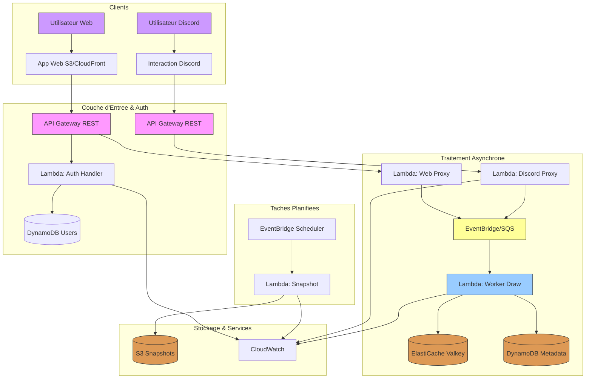

# C3: Cloud-Native & Serverless - Collaborative Pixel Canvas (r/place Clone)

## Présentation du Projet

Bienvenue dans la documentation officielle du projet **C3**. Ce projet a pour objectif de concevoir et d'implémenter un prototype fonctionnel d'une plateforme de dessin collaboratif multijoueur, entièrement serverless et inspirée de Reddit's r/place.

Les utilisateurs peuvent dessiner des pixels sur un canevas partagé via :

*   Un bot Discord (commandes slash).

*   Une interface web interactive.

Ce document décrit l'architecture, les choix techniques, la configuration et le déploiement de la solution sur **Amazon Web Services (AWS)**.

## Architecture Générale (Vue d'ensemble)

Le système est conçu selon des principes **serverless**, **event-driven** et **asynchrones**. Toutes les interactions passent par une couche d'API Gateway, puis sont traitées de manière découplée via des files d'attente et des fonctions Lambda.

