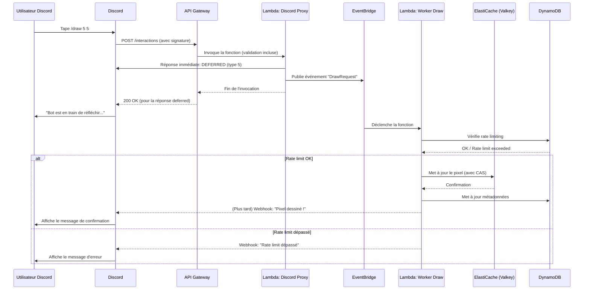

# 2. Discord Bot Development

## Objectif

Développer un bot Discord serverless qui permet d'interagir avec le canevas via des commandes slash, en utilisant les Interactions Discord.

---

## Configuration et Architecture

Le bot n'utilise **pas** de librairie comme `discord.js` en mode "self-hosted". Il est entièrement basé sur le système d'**Interactions** de Discord.

### 1. Portail Développeur Discord
- Créer une application et un bot.
- Définir les commandes slash :
  - `/draw <x> <y> <couleur_hex>`
  - `/canvas`
  - `/start` (Admin)
  - `/pause` (Admin)
  - `/reset` (Admin)
  - `/snapshot` (Admin)
- **Configurer l'Endpoint URL** : Mettre l'URL de votre API Gateway (ex: `https://api.votredomaine.com/discord/interactions`). Discord enverra toutes les interactions à cette URL.

### 2. AWS API Gateway
- Créer une route `POST /discord/interactions`.
- Configurer la **validation de requête** pour vérifier la signature `X-Signature-Ed25519` et `X-Signature-Timestamp` de Discord (sécurité essentielle).
- Intégrer cette route à une fonction **Lambda "DiscordInteractionProxy"**.

### 3. Lambda "DiscordInteractionProxy"

**Rôle** : Point d'entrée unique pour Discord.

**Actions** :
1. Vérifier la signature de la requête (re-jouer la validation faite par API Gateway si nécessaire, ou s'assurer qu'elle est bien faite).
2. Pour les commandes, répondre immédiatement par un `response` de type `DEFERRED_CHANNEL_MESSAGE_WITH_SOURCE` (type 5). Cela indique à Discord que la requête est bien reçue et que le bot répondra plus tard (évite le timeout de 3 secondes).
3. Publier un événement détaillant la commande sur **EventBridge** (ou SQS).
4. Se terminer.

---

## Commandes Implémentées

| Commande | Description | Permission |
|:---------|:------------|:-----------|
| `/draw <x> <y> <couleur_hex>` | Place un pixel sur le canevas | Tous |
| `/canvas` | Retourne l'URL de la dernière snapshot du canevas (stockée sur S3) | Tous |
| `/snapshot` | Déclenche manuellement la génération d'une snapshot | Admin |
| `/start` | Ouvre la session de dessin | Admin |
| `/pause` | Met en pause la session de dessin | Admin |
| `/reset` | Réinitialise le canevas | Admin |

> **Note** : Pour les commandes admin, la Lambda vérifie que l'utilisateur possède les rôles appropriés sur le serveur Discord avant d'exécuter l'action.

---

## Flux de Traitement d'une Commande `/draw`

