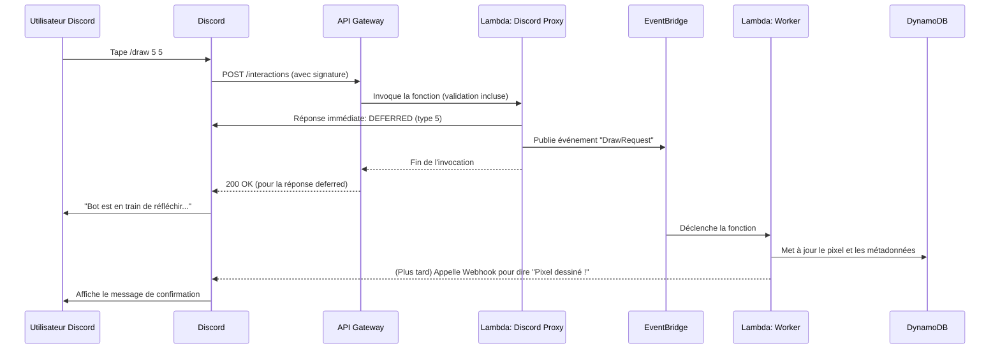

# 2. Discord Bot Development

## Objectif

Développer un bot Discord serverless qui permet d'interagir avec le canevas via des commandes slash, en utilisant les Interactions Discord.

## Configuration et Architecture

Le bot n'utilise **pas** de librairie comme `discord.js` en mode "self-hosted". Il est entièrement basé sur le système d'**Interactions** de Discord.

1. **Portail Développeur Discord** :
   - Créer une application et un bot.
   - Définir les commandes slash (`/draw`, `/canvas`, `/start`, `/pause`, `/reset`).
   - **Configurer l'Endpoint URL** : Mettre l'URL de votre API Gateway (ex: `https://api.votredomaine.com/discord/interactions`). Discord enverra toutes les interactions à cette URL.

2. **AWS API Gateway** :
   - Créez une route `POST /discord/interactions`.
   - Configurez la validation de requête pour vérifier la signature `X-Signature-Ed25519` et `X-Signature-Timestamp` de Discord (sécurité essentielle).
   - Intégrez cette route à une fonction **Lambda "DiscordInteractionProxy"**.

3. **Lambda "DiscordInteractionProxy"** :
   - **Rôle** : Point d'entrée unique pour Discord.
   - **Actions** :
     1. Vérifier la signature de la requête.
     2. Pour les commandes, répondre immédiatement par un `response` de type `DEFERRED_CHANNEL_MESSAGE_WITH_SOURCE` (type 5). Cela indique à Discord que la requête est bien reçue et que le bot répondra plus tard (évite le timeout de 3 secondes).
     3. Publier un événement détaillant la commande sur **EventBridge** (ou SQS).
     4. Se terminer.

## Commandes Implémentées

- `/draw <x> <y> <couleur_hex>` : Place un pixel sur le canevas.
- `/canvas` : Retourne l'URL de la dernière snapshot du canevas (stockée sur S3).
- `/start` / `/pause` / `/reset` (Admin) : Change l'état de la session (`open`/`paused`/`closed`) dans DynamoDB. Les workers refuseront les dessins si la session est en pause.

## Flux de Traitement d'une Commande `/draw`

